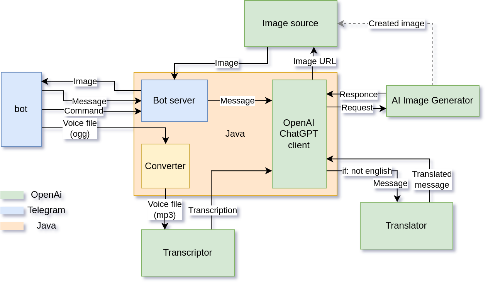

# OpenAI Image Generator Telegram Bot

This bot supports generating images from "voices".

## Prerequisites

You must have [ffmpeg][1] installed to provide audio conversions from the Ogg (Telegram) format to the MP3 (OpenAI required) format.

## Configuration

To store OpenAI API keys, you need to have a Redis server.

Also, you should configure the following environment variables:

| Env Variable               | Value Description                                               | Required |
|----------------------------|-----------------------------------------------------------------|----------|
| APP_OPENAI_TOKEN           | Provide if you are going to use it for yourself. Set by default | false    |
| APP_TELEGRAM_BOT_TOKEN     | Telegram API Token                                              | true     |
| SPRING_DATA_REDIS_HOST     | Your Redis server URL                                           | true     |
| SPRING_DATA_REDIS_PASSWORD | Redis password                                                  | true     |
| SPRING_DATA_REDIS_PORT     | Redis port                                                      | true     |
| FFMPEG_PATH                | Path to your ffmpeg                                             | true     |

## Application structure

[1]: https://www.hostinger.com/tutorials/how-to-install-ffmpeg
